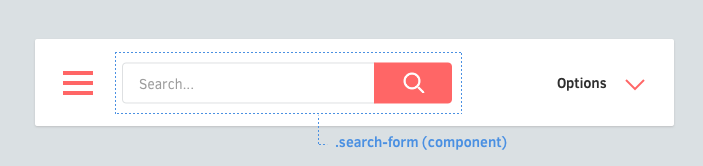

# RSCSS
## Reasonable System for CSS Stylesheet Structure

[rscss.io](http://rscss.io/)

----

- "What does this class mean?"
- "Is this class still being used?"
- "If I make a new class green, will there be a clash?"

---

## Naming convention

RSCSS is very similar to BEM.

```html
<!-- BEM -->
<form class='site-search site-search--full'>
	<input  class='site-search__field' type='text'>
	<button class='site-search__button'></button>
</form>
```

```html
<!-- rscss -->
<form class='site-search -full'>
	<input  class='field' type='text'>
	<button class='button'></button>
</form>
```

---

# What's the objective of ITCSS

----

<!-- .slide: data-background="#E5623D" data-transition="zoom" class="orange-slide" -->
# Lower specificity possible

---

## Components

Every piece of UI is an individual component



----

### Naming components

Components will be named with at least two words, separated by a dash. Examples of components:

- A like button `.like-button`
- A search form `.search-form`
- A news article card `.article-card`

---

## Elements

Elements are things inside your component


----

Each component may have elements, using **one word**

```css
.search-form {
  > .field { /* ... */ }
  > .action { /* ... */ }
}
```

----

Prefer to use the > child selector whenever possible. This prevents bleeding through nested components, and performs better than descendant selectors.

```css
.article-card {
  .title     { /* okay */ }
  > .author  { /* ✓ better */ }
}
```

---

## Variants

Components may have variants. Elements may have variants, too.


```css
.like-button {
  &.-wide { /* ... */ }
  &.-short { /* ... */ }
  &.-disabled { /* ... */ }
}
```

## Nested Components


---

## Layouts


- Positioning (position, top, left, right, bottom)
- Floats (float, clear)
- Margins (margin)
- Dimensions (width, height) *√ logos/images*

---

## Helpers

*...or trumps*

```
._unmargin { margin: 0 !important; }
._center { text-align: center !important; }
._pull-left { float: left !important; }
._pull-right { float: right !important; }
```